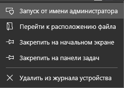
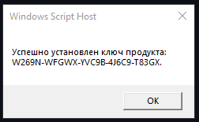
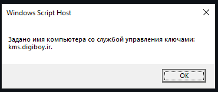
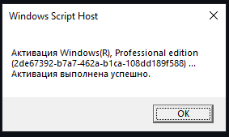
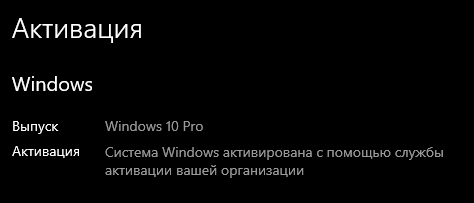

# Активация Windows 

Я знаю, что у многих пользователей системы Windows, к большому сожалению, она не активирована. Некоторые до сих пор думают, что исправить это можно лишь тратой денег на официальный ключ. На самом деле это не так, и этот проект - доказательство этому.

### ❗ Внимание: 

Я бы хотел предупредить, что все ниже описанные действия незаконны, вы можете купить оффициальный ключ для Windows на оффициальном сайте:
*https://microsoft.com*

### Для Windows 10/11:
### Если вы не хотите мучиться, вы можете скачать мой готовый [файл](https://github.com/Artik1279/Windows-activator/blob/main/ActivatorWindows10-11.bat) со всеми командами. Вам необходимо будет лишь запустить его от имени администратора!

Сегодня я бы хотел осветить достаточно простой способ активации Windows. Все, что вам понадобится, это умение писать и читать.

Для начала откройте командную строку (cmd.exe) от имени администратора. Вы можете сделать это, написав в поиске cmd, нажав правый клик по нужному приложению и выбрав из меню "Запуск от имени администратора".

После у вас должна открыться командная строка. Не бойтесь её, ничего программировать мы не будем, а лишь напишем пару нужных команд:

## 1. Установка корпоративного ключа: 

Для успешной активации нам необходимо воспользоваться общедоступным корпоративным ключом, для разных версий Windows они разные, ниже я привел самые популярные:
| Издание           | Ключ                          |
|-------------------|-------------------------------|
| Windows 10/11 Pro | W269N-WFGWX-YVC9B-4J6C9-T83GX |
| Windows 8.1 Pro   | GCRJD-8NW9H-F2CDX-CCM8D-9D6T9 |
| Windows 7 Pro     | FJ82H-XT6CR-J8D7P-XQJJ2-GPDD4 |

Если вы не нашли ваше издание, то больше ключей можно найти здесь: *https://learn.microsoft.com/ru-ru/windows-server/get-started/kms-client-activation-keys*

После того, как вы заполучили нужный вам ключ, в командной строке необходимо ввести следующую команду:
slmgr /ipk ВАШ_КЛЮЧ

После этого вам должны сообщить:

Если это так, то продолжаем!

## 2. Задаем службу активации: 

Для успешной активации нам необходимо задать необходимое имя для службы активации, это имя - адрес официального сервера.

Введите в консоль следующую команду: 
slmgr /skms kms.digiboy.ir

Результат:

## 3. Активация и завершение: 

После всех ранее описанных действий нам осталось лишь ввести команду активации: 
slmgr /ato

После ввода этой команды подождите несколько секунд, и вам сообщат:

Не забудьте перезагрузить ваш компьютер для полного применения всех действий!

## ✅ Поздравляю! Ваша копия Windows была успешно активирована!

Если у вас возникли какие-либо проблемы - создайте [Issues](https://github.com/Artik1279/Windows-activator/issues), и я постараюсь вам помочь!
